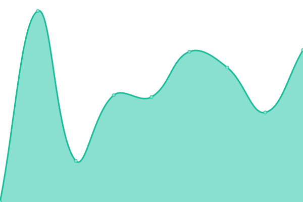
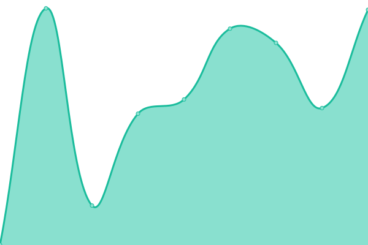
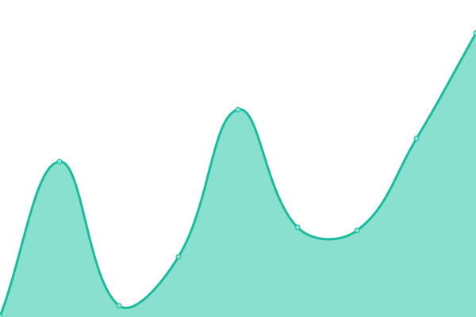
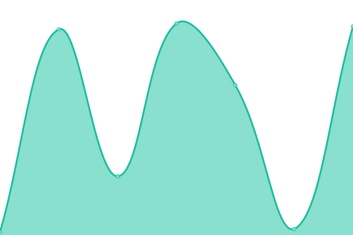

# [📈 Live Status](https://demo.upptime.js.org): <!--live status--> **Tüm sistemler sorunsuz çalışıyor**

This repository contains the open-source uptime monitor and status page for [Upptime](https://upptime.js.org), powered by [Upptime](https://github.com/upptime/upptime).

With [Upptime](https://upptime.js.org), you can get your own unlimited and free uptime monitor and status page, powered entirely by a GitHub repository. We use [Issues](https://github.com/upptime/upptime/issues) as incident reports, [Actions](https://github.com/seyitacar/evcilimstatus/actions) as uptime monitors, and [Pages](https://demo.upptime.js.org) for the status page.

<!--start: status pages-->
<!-- This summary is generated by Upptime (https://github.com/upptime/upptime) -->
<!-- Do not edit this manually, your changes will be overwritten -->
<!-- prettier-ignore -->
| Link | Durum | Geçmiş | Yanıt Süresi | Çevrimiçi Süresi |
| --- | ------ | ------- | ------------- | ------ |
|  [Anasayfa](https://evcil.im/) | Çevrimiçi | [anasayfa.yml](https://github.com/seyitacar/evcilimstatus/commits/HEAD/history/anasayfa.yml) | 

 721ms
     
 | 

<a href="https://durum.evcil.im/history/anasayfa">100.00%</a>
    

|  [Evcil Profil Sayfaları](https://ben.evcil.im/varsayilan/) | Çevrimiçi | [evcil-profil-sayfalari.yml](https://github.com/seyitacar/evcilimstatus/commits/HEAD/history/evcil-profil-sayfalari.yml) | 

 686ms
     
 | 

<a href="https://durum.evcil.im/history/evcil-profil-sayfalari">100.00%</a>
    

|  [Evcil Profil Düzenleme](https://ben.evcil.im/login) | Çevrimiçi | [evcil-profil-duezenleme.yml](https://github.com/seyitacar/evcilimstatus/commits/HEAD/history/evcil-profil-duezenleme.yml) | 

 296ms
     
 | 

<a href="https://durum.evcil.im/history/evcil-profil-duezenleme">100.00%</a>
    

|  [E-posta Servisleri](witcher.mxrouting.net) | Çevrimiçi | [e-posta-servisleri.yml](https://github.com/seyitacar/evcilimstatus/commits/HEAD/history/e-posta-servisleri.yml) | 

 48ms
     
 | 

<a href="https://durum.evcil.im/history/e-posta-servisleri">100.00%</a>
    

<!--end: status pages-->

[**Visit our status website →**](https://demo.upptime.js.org)

## 📄 License

- Powered by: [Upptime](https://github.com/upptime/upptime)
- Code: [MIT](./LICENSE) © [Anand Chowdhary](https://anandchowdhary.com), supported by [Pabio](https://pabio.com)
- Data in the `./history` directory: [Open Database License](https://opendatacommons.org/licenses/odbl/1-0/)
